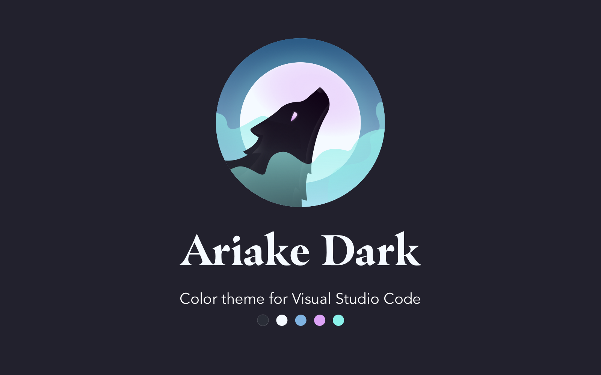

# donato ariake dark

  <a href="https://marketplace.visualstudio.com/items?itemName=ebdonato.donato-ariake-dark">VS Code Marketplace</a>
  &nbsp;·&nbsp;
  <a href="https://open-vsx.org/extension/ebdonato/donato-ariake-dark">Open VSX Registry</a>

Dark theme for VS Code and Google Antigravity IDE, forked from [Ariake Dark](https://github.com/a-wart/ariake-dark) by [Artem](https://github.com/a-wart), and that one forked from [Ariake Dark](https://github.com/pathtrk/ariake-dark-syntax) by [@pathtrk](https://github.com/pathtrk/).

Ariake is a syntax theme inspired by Japanese traditional colors and the poetry composed 1000 years ago. This fork ships two variants:

- **Flat** — soft surfaces, standard editor background.
- **OLED** — true black background for OLED displays and reduced bloom.

"有明の　つれなく見えし　別れより　暁ばかり　憂きものはなし" - Mibu no Tadamine (壬生忠岑)

"Since I saw the moon in dawn when you said good-bye, My heart aches every time I see it again."

## Screenshot examples

### Flat Variant

### Oled Variant

## License

[MIT](LICENSE)

## Made by with 💛

   
  <strong>Eduardo DONATO</strong>

**Enjoy!**
