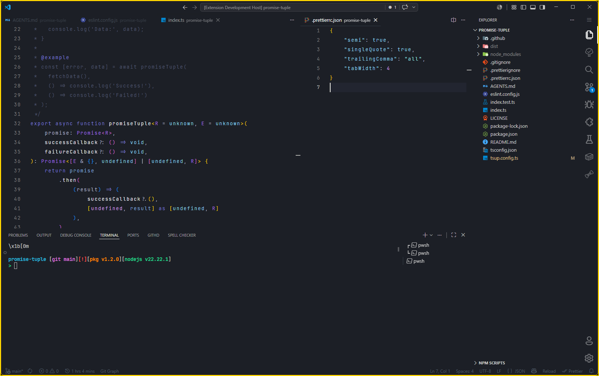
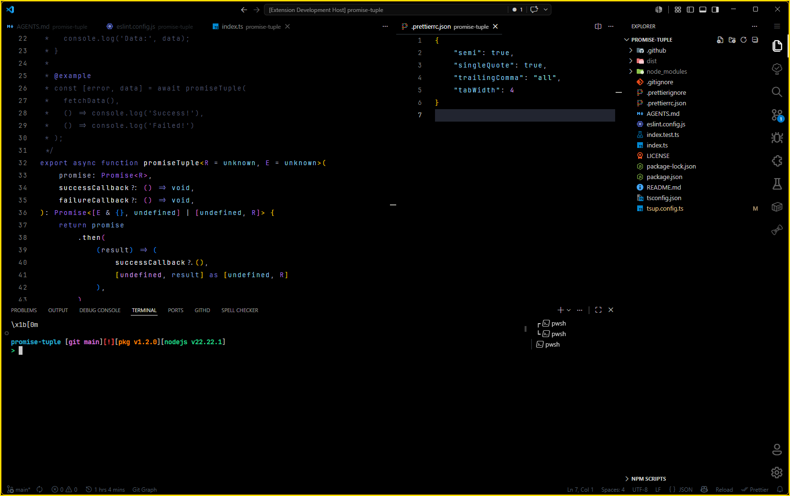

# donato ariake dark

 

  <a href="https://marketplace.visualstudio.com/items?itemName=ebdonato.donato-ariake-dark">VS Code Marketplace</a>
  &nbsp;·&nbsp;
  <a href="https://open-vsx.org/extension/ebdonato/donato-ariake-dark">Open VSX Registry</a>

Dark theme for VS Code and Google Antigravity IDE, **inspired by** — but not the same as — [Ariake Dark](https://github.com/a-wart/ariake-dark) by [Artem](https://github.com/a-wart), which itself was derived from [Ariake Dark](https://github.com/pathtrk/ariake-dark-syntax) by [@pathtrk](https://github.com/pathtrk/).

This is an independent reinterpretation of the Ariake palette, not a fork or a copy. The original theme by [@pathtrk](https://github.com/pathtrk/) draws on Japanese traditional colors and the poetry composed 1000 years ago. This version reworks that aesthetic with its own color choices, token mappings, and surface styling, and ships two variants:

- **Flat** — soft surfaces, standard editor background.
- **OLED** — true black background for OLED displays and reduced bloom.

If you enjoy the original Ariake Dark, please support its authors. This extension is a separate project created by [Eduardo DONATO](https://github.com/ebdonato) and is not affiliated with, endorsed by, or derived from the original themes.

> The original theme Ariake Dark can be found [here](https://marketplace.visualstudio.com/items?itemName=wart.ariake-dark).

"有明の　つれなく見えし　別れより　暁ばかり　憂きものはなし" - Mibu no Tadamine (壬生忠岑)

"Since I saw the moon in dawn when you said good-bye, My heart aches every time I see it again."

## Screenshot examples

### Flat Variant

### Oled Variant

## License

[MIT](LICENSE)

## Made by with 💛

   
  <strong>Eduardo DONATO</strong>

**Enjoy!**
